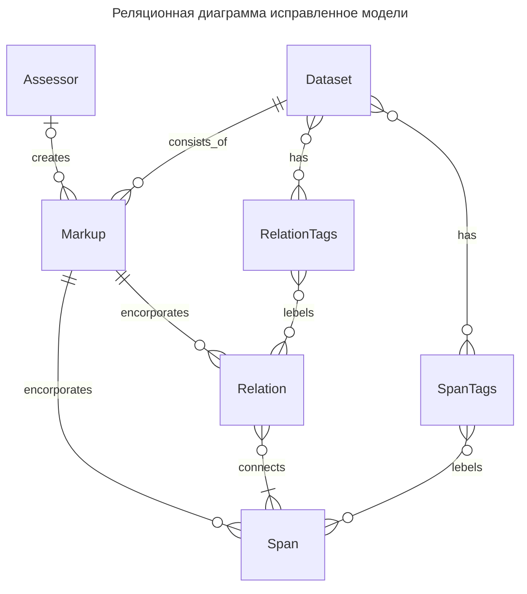
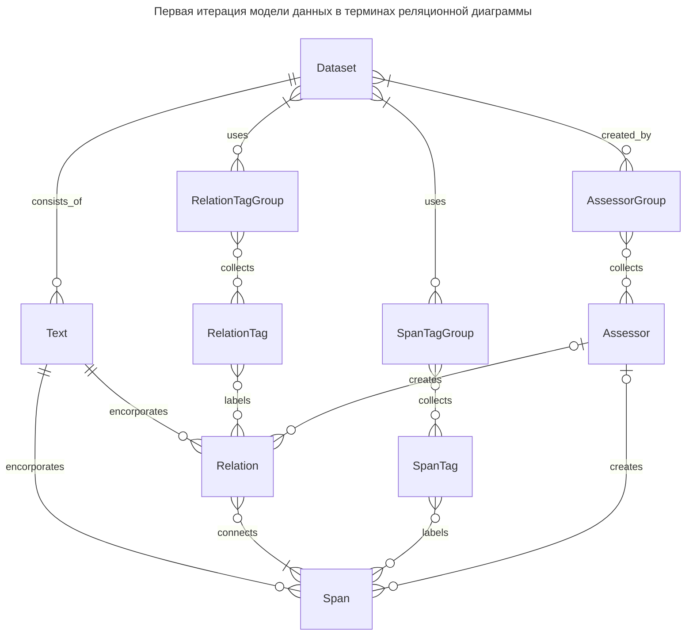

<H1>Унифицированный формат датасетов котнент-анализа в терминах реляционных диаграм</H1>

Встреча от 23.07.2024 показала, что в формате данных, предложенных и Андреем ранее, все же существуют неоптимальные решения. Однако вместе с проблемой в самом датасете выявилась еще одна: несостоятельность той документации, что сопровожала изначальный формат, что повлияло на слишком большой порог сложности для остальных участников понять, что формат из себя представляет. Было приянто решение исправить все ошибки в одном документе и описать формат данных на общепризнаном диалекте **Реляционных диаграм**[^1].

В данном документе подробно описывается модель данных нового формата датасетов и проводится его сравненик с первой редакцией.

---

<H3>Формат датасета</H3>

1. Модель данных двух сущностей: "разметчик" и "датасет". Первая сущность определяет всех известных разметчиков, разметки которых рассматриваются в наборе данных. Понятие же "датасет" отвечает за разметки, выполненные в соответствии с поставленной перед разметчиками задачей, тексты и рубрикатор, над которыми производилась разметка.
2. "Датасет" состоит из "разметок" и обладает множествами тегов (меток), используемых в классификации сущностей в текстах и их связей.
3. "Разметка" включает в себя сами отклассифицированные фрагменты, ассоциируемые с сущностями в текстах, а так же отклассифцированные связи.

Представление реляционной диаграмы в формате записи json выполняется следующим образом:

    {
        "assessors": List[str],
        "dataset": {
            "span_tags": List[str],
            "relation_tags": List[str],
            "markups": List[
                {
                    "assessor": int | None,
                    "text": str,
                    "spans": {
                        "begin": int,
                        "end": int,
                        "id": int,
                        "tags": List[int]
                    },
                    "relations": {
                        "spans": List[int],
                        "tags": List[int]
                    }
                }
            ]
        }
    }

---

<H3>Сравнение с первоначально предложенной моделью</H3>

Сразу видно, что модель данных получается много более сложной, с большим сущностей и связей между ними на нижних уровнях иерархии. Вместе с логическим устройством модели усложныется и json представление:

    {
        "span_tags": List[tuple[str, List[str]]],
        "relation_tags": List[tuple[str, List[str]]],
        "assessor": List[tuple[str, List[str]]],
        "texts": List[
            {
                "text": str,
                "spans": List[
                    {
                        "begin": int,
                        "end": int,
                        "id": int,
                        "tags": List[tuple[int, int]],
                        "only_for_re": bool,
                        "assessor": tuple[int, int] | None
                    }
                ],
                "relations": List[
                    {
                        "spans": List[int],
                        "tags: List[tuple[int, int]],
                        "assessor": tuple[int, int] | None
                    }
                ]
            }
        ]
    }

**Отличия двух форматов:**

1. Очевидным отличем является уменьшенное число сущностей у обновленной модели данных, что должно положительно сказаться на работу людей, сопровождающих как сам перевод в сам формат, так и людей, непосредственно работающих с данными в него переведенными.
2. В новом формате понятие приемственности атомарной сущности (фрагмент текста (span) или их связь (relation)) описывается в свойстве авторства самой разметки: в старом формате мы указывали авторство для каждой атомарной сущности, теперь мы считаем, что все объекты в одной разметке принадлежат тому, кто эту разметку создал.
3. В старом формате предполагалось существование явно оформленных групп тегов и групп разметчиков, однако в исправленной версии мы от таких понятий отказались и каждый набор представляется множеством сущностей. Это очень загружает формат и делает его явно менее привлекательным для работы, в особенности в предположении, что эти особенности будут использоваться далеко не в каждом датасете извне.
4. Для сущности фрагмента (span) в первоначальной итерации модели данных присутсвовало поле `only_for_re`, что не очень понятно, для чего нужно[^2].

[^1]: Почитать про реляционные диаграммы и как к ним относиться можно по [ссылке](https://www.lucidchart.com/pages/er-diagrams), более детально познакомиться с моделированием данных можно по [лекциям](https://www.youtube.com/watch?v=0R67wu0oDPk&list=PLhe7c-LCgl4I8KDZne0c1FnZ553sAR9eX&index=10), что я очень рекомендую.

[^2]: Ответ Андрея: "суть в том, что мы все спаны кладем в одну кучу (поле spans), в том числе и те, которые относятся к задаче RE, но не относятся к задаче NER. Мне кажется, если убрать `only_for_re`, то будет неверно, и спан может использоваться в обучении задачи на NER, хотя он чисто к RE относится"... "Но я правда такое не видел ни разу, может, такого нигде и нет".

