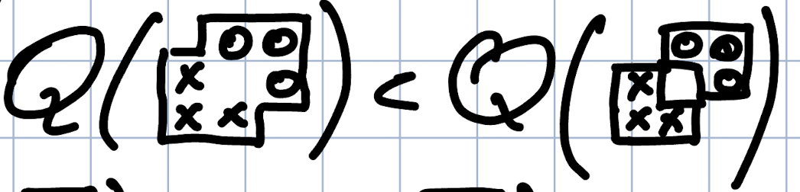
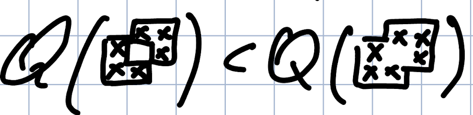
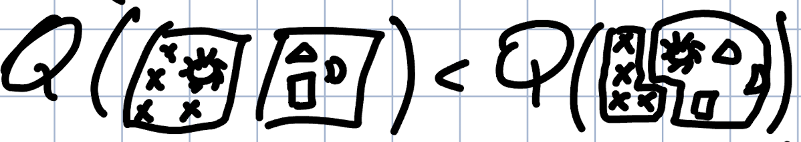

<H1>Заметки к встрече по моделям 23.07.2024</H1>

---

**Метрики**: Саша подготовил метрику по универсальной разметке, чтобы оан работала на сравнеии ground-truth разметок с машинной разметкой. Список вопросов:

1. Ограничена ли метрика?
2. Показывает ли предлагаемая метрика меру overlap между ground-truth и prediction разметками и если да, то как именно? Учитываются ли классы при оценке правильности выделения границ спанов? Если на это да, то выполняются ли для нее хотя бы эмпирически свойства: гомогенности, полноты и Rag-bag

| Гомогенность                | Полнота                          | Rag-bag                  |
| --------------------------- | -------------------------------- | ------------------------ |
|  |  |  |

1. Показывает ли метрика качесвто кассификации NE при полном элайнменте сущностей между двумя разметками? Как это происходит: на уровне токенов текста, на уровне выделенных span?
2. Способна ли метрика работать с фложенными фрагментами одного и того же класса? *(Пример: Support Vector Machine (entities: \<Vector Machine>, \<Vector>, \<Machine>))*
3. Работает ли метрика работать с иерархической структурой меток (классов)?
4. Устойчива ли метрика к малым "колебаниям" в разметке? Или же при минимальном изменении границ фрагментов, изменении связи между двумя сущностями - метрика может меняться на относительно большое число?

> Сашина метрика является лишь одной из возможных для нашего использования. Поэтому на семинаре предлагается выслушать Ангелину с ее рукотворной метрикой, применяемой в конкурсе Диалог2024.

---

**Формат разметки:** более пристальный взгляд на получившийся универсальный формат разметки, подготовленный Андреем, поднял несколько вопросов, которые нужно обозначить и решить как можно скорее. Вместе с тем есть и явные ошибки, что следует просто поправить:

1. Почему в формате универсальной разметки присутствуют именно группы меток (span_tags, relation_tags)? Почему мы не используем иерархическую систему представления структуры классов? (Структура множества тегов вложена в иерархическое представление, покуда обратное включение не является верным). При этом мы не подразумеваем возможность попадания одного и того же тега в два разных множества в нашем формате. 
2. Нужны ли нам система с группами разметчиков? Или же есть смысл от этого понятия отказаться в пользу добавления личной инофрмации о пользователе (вместо разделения разметчиков на группы просто для каждого разметчика внутри его объекта описать его причастность к определенным группам)
3. сamelCase внутри json файла является кощунством: поле **OnlyForRE** сущности Span должно писаться через нижние подчеркивания (snake_case)

---

**Framework для моделей универсальной разметки:** первоначальная идея работы предполагает создание универсального формата датасетов для контентанализа, а так же универсализация работы моделей над данными датасетами. Таким образом становится очевидной потребность в создании фреймворка, что автоматизировал и стандартизировал бы нашу работу.

> Данное чудо инженерной мысли пока временно носит название "Generalized Context Analysis", что описана в следующем документе: [Generalized Context Analysis framework](https://www.overleaf.com/read/krhyjzmrgctr#131fd3)

В данном контексте важно понимать, собираемся ли мы изначально создавать фреймворк и только после этого проводить эксперименты, или же мы хотим уже сейчас начать работать, параллельно реализовывая фреймворк. Так же важно понимать, кто этим будет заниматься.

---

**Работа команды:** на этой встрече нужно полностью определиться с формой отчетности работы участников, понять, кто какие задачи в итоге на себя берет, построить road-map на ближайшее время.

Формат работы: будем действовать в формате спринтов, в рамках каждого из которых рассматривается своя задача NLP и каждый выбирает один подход к решению данной задачи. На выбранных датасетах, переведенных в унифицированный формат разметки контент анализа, прогоняются рассматриваемые каждым участником модели, качество работы которых замеряется на основе зафиксированных метрик. Под конец спринта каждый участник подготавливает минимальную презентацию на три слайда, где описывает максимально крастко, что за подход он использовал, какие модели брал, какие датасеты использовал, какие метрики на них получил.

Ниже максимально общно представлен возможный road-map:
1. NER
2. Relation Extraction
3. Text Classification
4. Text Generation

Конечным результатом работы группы является четырехмерный тензор: 

$$[model \times method \times dataset \times metric]$$

---

**Датасеты:** Для ближайшей работы требуется определиться с подвыборкой датасетов из уже собранного бенчмарка, чтобы не распыляться сразу на все возможное. Все такие датасеты должны находить по [ссылке](https://docs.google.com/spreadsheets/d/1-Wd7gAEEDaDUOXsC8tqaWxYEBnnbgc-Eqo6x6dppPoQ/edit?gid=0#gid=0). Кто еще не занес свои датасеты в таблицу должны это сделать.

---

**Наши разметки:** наша лаборатория подготовила два собственных датасета: "Культурный код" и "Эмоции". Если мы хотим использовать данные разметки в будущем, нужно проверить целостность разметки и согласованность самих разметчиков. Второе полностью подходит под работу Александра. Первое может выходить за рамки его работы. 

> Подцелостностью понимается соответсвие фактических данных, лежащих в базе данных, той инструкции, что была выдана разметчикам при их работе.
